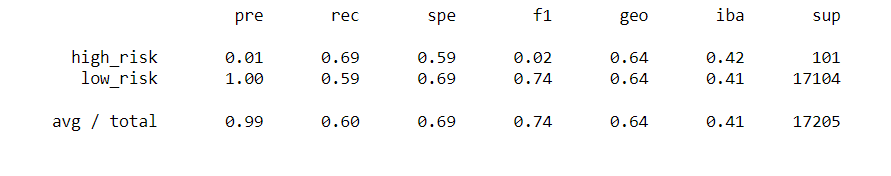
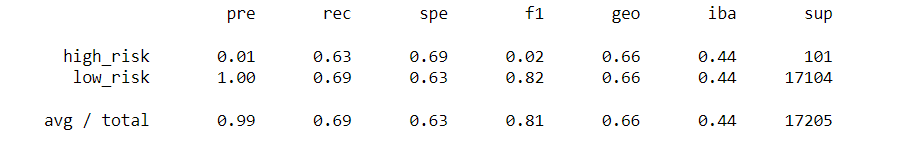
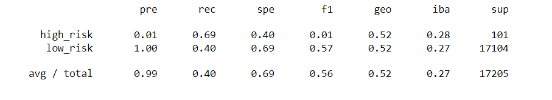
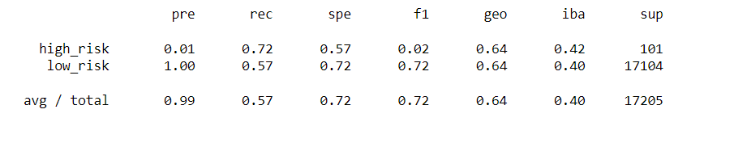
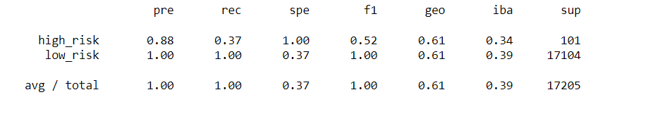

# Credit_Risk_Analysis

## Overview of the Analysis
The purpose of this analysis is to apply machine learning to solve a real-world challenge: credit card risk.

## Results

### Naive Random Oversampling

The naive random oversampling method showed an average precision and recall of 0.99 and 0.60 respectuflly.

### SMOTE Oversampling
 
 
 The SMOTE oversampling method showed an average precision and recall of 0.99 and 0.69 respectuflly.
 
### Undersampling

The undersampling method showed an average precision and recall of 0.99 and 0.40 respectuflly.

### Combination (Over and Under) Sampling

The combination method showed an average precision and recall of 0.99 and 0.57 respectuflly.

### Balanced Random Forest Classifier

The random forest classifier had an F1 score of 1.00 for identifying low-risk customers, with precision and recall metrics both equal to 1.00 for low-risk.

### Easy Ensemble AdaBoost Classifier
I was not able to get the EasyEnesembleClassifier to perform.

## Summary

As to the metric of precision, we cannot claim that any method was better or worse than any other, as they all had identical scores - high_risk = 0.01 and low-risk = 1.00

I would probably have to recommend the random forest model, as it showed a perfect 1.00 F1 score for identifying low-risk cutomers.

